<h1 align="center">  Google Play Store Apps Data Analysis & Visualization</h1>

<h3 align="center"> ( Data From 2010 To 2018 ) </h3>

---

## Import Libraries


```python
import pandas as pd
import numpy as np
import matplotlib.pyplot as plt
%matplotlib inline
import seaborn as sns

import warnings
warnings.filterwarnings("ignore")
```

## Getting Know About Dataset


```python
df = pd.read_csv('googleplaystore.csv')
```


```python
df.head()
```


<div>
<style scoped>
    .dataframe tbody tr th:only-of-type {
        vertical-align: middle;
    }

    .dataframe tbody tr th {
        vertical-align: top;
    }

    .dataframe thead th {
        text-align: right;
    }
</style>
<table border="1" class="dataframe">
  <thead>
    <tr style="text-align: right;">
      <th></th>
      <th>App</th>
      <th>Category</th>
      <th>Rating</th>
      <th>Reviews</th>
      <th>Size</th>
      <th>Installs</th>
      <th>Type</th>
      <th>Price</th>
      <th>Content Rating</th>
      <th>Genres</th>
      <th>Last Updated</th>
      <th>Current Ver</th>
      <th>Android Ver</th>
    </tr>
  </thead>
  <tbody>
    <tr>
      <th>0</th>
      <td>Photo Editor &amp; Candy Camera &amp; Grid &amp; ScrapBook</td>
      <td>ART_AND_DESIGN</td>
      <td>4.1</td>
      <td>159</td>
      <td>19M</td>
      <td>10,000+</td>
      <td>Free</td>
      <td>0</td>
      <td>Everyone</td>
      <td>Art &amp; Design</td>
      <td>January 7, 2018</td>
      <td>1.0.0</td>
      <td>4.0.3 and up</td>
    </tr>
    <tr>
      <th>1</th>
      <td>Coloring book moana</td>
      <td>ART_AND_DESIGN</td>
      <td>3.9</td>
      <td>967</td>
      <td>14M</td>
      <td>500,000+</td>
      <td>Free</td>
      <td>0</td>
      <td>Everyone</td>
      <td>Art &amp; Design;Pretend Play</td>
      <td>January 15, 2018</td>
      <td>2.0.0</td>
      <td>4.0.3 and up</td>
    </tr>
    <tr>
      <th>2</th>
      <td>U Launcher Lite – FREE Live Cool Themes, Hide ...</td>
      <td>ART_AND_DESIGN</td>
      <td>4.7</td>
      <td>87510</td>
      <td>8.7M</td>
      <td>5,000,000+</td>
      <td>Free</td>
      <td>0</td>
      <td>Everyone</td>
      <td>Art &amp; Design</td>
      <td>August 1, 2018</td>
      <td>1.2.4</td>
      <td>4.0.3 and up</td>
    </tr>
    <tr>
      <th>3</th>
      <td>Sketch - Draw &amp; Paint</td>
      <td>ART_AND_DESIGN</td>
      <td>4.5</td>
      <td>215644</td>
      <td>25M</td>
      <td>50,000,000+</td>
      <td>Free</td>
      <td>0</td>
      <td>Teen</td>
      <td>Art &amp; Design</td>
      <td>June 8, 2018</td>
      <td>Varies with device</td>
      <td>4.2 and up</td>
    </tr>
    <tr>
      <th>4</th>
      <td>Pixel Draw - Number Art Coloring Book</td>
      <td>ART_AND_DESIGN</td>
      <td>4.3</td>
      <td>967</td>
      <td>2.8M</td>
      <td>100,000+</td>
      <td>Free</td>
      <td>0</td>
      <td>Everyone</td>
      <td>Art &amp; Design;Creativity</td>
      <td>June 20, 2018</td>
      <td>1.1</td>
      <td>4.4 and up</td>
    </tr>
  </tbody>
</table>
</div>


```python
df.tail()
```


<div>
<style scoped>
    .dataframe tbody tr th:only-of-type {
        vertical-align: middle;
    }

    .dataframe tbody tr th {
        vertical-align: top;
    }

    .dataframe thead th {
        text-align: right;
    }
</style>
<table border="1" class="dataframe">
  <thead>
    <tr style="text-align: right;">
      <th></th>
      <th>App</th>
      <th>Category</th>
      <th>Rating</th>
      <th>Reviews</th>
      <th>Size</th>
      <th>Installs</th>
      <th>Type</th>
      <th>Price</th>
      <th>Content Rating</th>
      <th>Genres</th>
      <th>Last Updated</th>
      <th>Current Ver</th>
      <th>Android Ver</th>
    </tr>
  </thead>
  <tbody>
    <tr>
      <th>10836</th>
      <td>Sya9a Maroc - FR</td>
      <td>FAMILY</td>
      <td>4.5</td>
      <td>38</td>
      <td>53M</td>
      <td>5,000+</td>
      <td>Free</td>
      <td>0</td>
      <td>Everyone</td>
      <td>Education</td>
      <td>July 25, 2017</td>
      <td>1.48</td>
      <td>4.1 and up</td>
    </tr>
    <tr>
      <th>10837</th>
      <td>Fr. Mike Schmitz Audio Teachings</td>
      <td>FAMILY</td>
      <td>5.0</td>
      <td>4</td>
      <td>3.6M</td>
      <td>100+</td>
      <td>Free</td>
      <td>0</td>
      <td>Everyone</td>
      <td>Education</td>
      <td>July 6, 2018</td>
      <td>1</td>
      <td>4.1 and up</td>
    </tr>
    <tr>
      <th>10838</th>
      <td>Parkinson Exercices FR</td>
      <td>MEDICAL</td>
      <td>NaN</td>
      <td>3</td>
      <td>9.5M</td>
      <td>1,000+</td>
      <td>Free</td>
      <td>0</td>
      <td>Everyone</td>
      <td>Medical</td>
      <td>January 20, 2017</td>
      <td>1</td>
      <td>2.2 and up</td>
    </tr>
    <tr>
      <th>10839</th>
      <td>The SCP Foundation DB fr nn5n</td>
      <td>BOOKS_AND_REFERENCE</td>
      <td>4.5</td>
      <td>114</td>
      <td>Varies with device</td>
      <td>1,000+</td>
      <td>Free</td>
      <td>0</td>
      <td>Mature 17+</td>
      <td>Books &amp; Reference</td>
      <td>January 19, 2015</td>
      <td>Varies with device</td>
      <td>Varies with device</td>
    </tr>
    <tr>
      <th>10840</th>
      <td>iHoroscope - 2018 Daily Horoscope &amp; Astrology</td>
      <td>LIFESTYLE</td>
      <td>4.5</td>
      <td>398307</td>
      <td>19M</td>
      <td>10,000,000+</td>
      <td>Free</td>
      <td>0</td>
      <td>Everyone</td>
      <td>Lifestyle</td>
      <td>July 25, 2018</td>
      <td>Varies with device</td>
      <td>Varies with device</td>
    </tr>
  </tbody>
</table>
</div>


---

## Data Cleaning


```python
#check data types
df.info()
```

    <class 'pandas.core.frame.DataFrame'>
    RangeIndex: 10841 entries, 0 to 10840
    Data columns (total 13 columns):
     #   Column          Non-Null Count  Dtype  
    ---  ------          --------------  -----  
     0   App             10841 non-null  object 
     1   Category        10841 non-null  object 
     2   Rating          9367 non-null   float64
     3   Reviews         10841 non-null  object 
     4   Size            10841 non-null  object 
     5   Installs        10841 non-null  object 
     6   Type            10840 non-null  object 
     7   Price           10841 non-null  object 
     8   Content Rating  10840 non-null  object 
     9   Genres          10841 non-null  object 
     10  Last Updated    10841 non-null  object 
     11  Current Ver     10833 non-null  object 
     12  Android Ver     10838 non-null  object 
    dtypes: float64(1), object(12)
    memory usage: 1.1+ MB
    


```python
#check null values
df.isnull().sum()
```


    App                  0
    Category             0
    Rating            1474
    Reviews              0
    Size                 0
    Installs             0
    Type                 1
    Price                0
    Content Rating       1
    Genres               0
    Last Updated         0
    Current Ver          8
    Android Ver          3
    dtype: int64


```python
# Fill Rating Null Values With Means Of Rating Coluumn

df['Rating'].fillna((df['Rating'].mean()), inplace=True)
```


```python
# Drop Other Rows With  Misiing Values

df.dropna(inplace=True)
```


```python
#change 'review' column data type to numeric

df['Reviews'] = pd.to_numeric(df['Reviews'])
```


```python
#seperate price with '$' mark

df['Price'] = df['Price'].apply(lambda x: str(x).replace('$', '') if '$' in str(x) else str(x))
df['Price'] = df['Price'].apply(lambda x: float(x))
```


```python
# Convert 'Last_Updated' Column Data type To datetime Format

df['Last Updated'] = pd.to_datetime(df['Last Updated'])
```


```python
# Seperate Year From 'Last_Updated' Column

df['Last_Updated_Year'] = df['Last Updated'].dt.year
```


```python
#seperate '+' marks from values

df['Installs'] = df['Installs'].apply(lambda x: str(x).replace('+', '') if '+' in str(x) else str(x))
df['Installs'] = df['Installs'].apply(lambda x: str(x).replace(',', '') if ',' in str(x) else str(x))
df['Installs'] = df['Installs'].apply(lambda x: float(x))
```


```python
# check agin to confirm the changes

df.dtypes
```


    App                          object
    Category                     object
    Rating                      float64
    Reviews                       int64
    Size                         object
    Installs                    float64
    Type                         object
    Price                       float64
    Content Rating               object
    Genres                       object
    Last Updated         datetime64[ns]
    Current Ver                  object
    Android Ver                  object
    Last_Updated_Year             int64
    dtype: object


```python
# display first 5 rows after changes

df.head(3)
```


<div>
<style scoped>
    .dataframe tbody tr th:only-of-type {
        vertical-align: middle;
    }

    .dataframe tbody tr th {
        vertical-align: top;
    }

    .dataframe thead th {
        text-align: right;
    }
</style>
<table border="1" class="dataframe">
  <thead>
    <tr style="text-align: right;">
      <th></th>
      <th>App</th>
      <th>Category</th>
      <th>Rating</th>
      <th>Reviews</th>
      <th>Size</th>
      <th>Installs</th>
      <th>Type</th>
      <th>Price</th>
      <th>Content Rating</th>
      <th>Genres</th>
      <th>Last Updated</th>
      <th>Current Ver</th>
      <th>Android Ver</th>
      <th>Last_Updated_Year</th>
    </tr>
  </thead>
  <tbody>
    <tr>
      <th>0</th>
      <td>Photo Editor &amp; Candy Camera &amp; Grid &amp; ScrapBook</td>
      <td>ART_AND_DESIGN</td>
      <td>4.1</td>
      <td>159</td>
      <td>19M</td>
      <td>10000.0</td>
      <td>Free</td>
      <td>0.0</td>
      <td>Everyone</td>
      <td>Art &amp; Design</td>
      <td>2018-01-07</td>
      <td>1.0.0</td>
      <td>4.0.3 and up</td>
      <td>2018</td>
    </tr>
    <tr>
      <th>1</th>
      <td>Coloring book moana</td>
      <td>ART_AND_DESIGN</td>
      <td>3.9</td>
      <td>967</td>
      <td>14M</td>
      <td>500000.0</td>
      <td>Free</td>
      <td>0.0</td>
      <td>Everyone</td>
      <td>Art &amp; Design;Pretend Play</td>
      <td>2018-01-15</td>
      <td>2.0.0</td>
      <td>4.0.3 and up</td>
      <td>2018</td>
    </tr>
    <tr>
      <th>2</th>
      <td>U Launcher Lite – FREE Live Cool Themes, Hide ...</td>
      <td>ART_AND_DESIGN</td>
      <td>4.7</td>
      <td>87510</td>
      <td>8.7M</td>
      <td>5000000.0</td>
      <td>Free</td>
      <td>0.0</td>
      <td>Everyone</td>
      <td>Art &amp; Design</td>
      <td>2018-08-01</td>
      <td>1.2.4</td>
      <td>4.0.3 and up</td>
      <td>2018</td>
    </tr>
  </tbody>
</table>
</div>


---

## Exploratory Data Analysis & Visualization

> ## Top 10 Categories With Highest Apps Count


```python
#Top Categories With Highest Apps

df['Category'].value_counts().head(10)
```


    FAMILY             1968
    GAME               1144
    TOOLS               841
    MEDICAL             463
    BUSINESS            460
    PRODUCTIVITY        424
    PERSONALIZATION     390
    COMMUNICATION       387
    SPORTS              384
    LIFESTYLE           382
    Name: Category, dtype: int64


> ## Each Categories With Apps Count


```python
# Visualiza Apps Count By Category

plt.figure(figsize=(15,8.5))
sns.countplot(df['Category'])
plt.xticks(rotation='vertical',size=12)
plt.show()
```


    
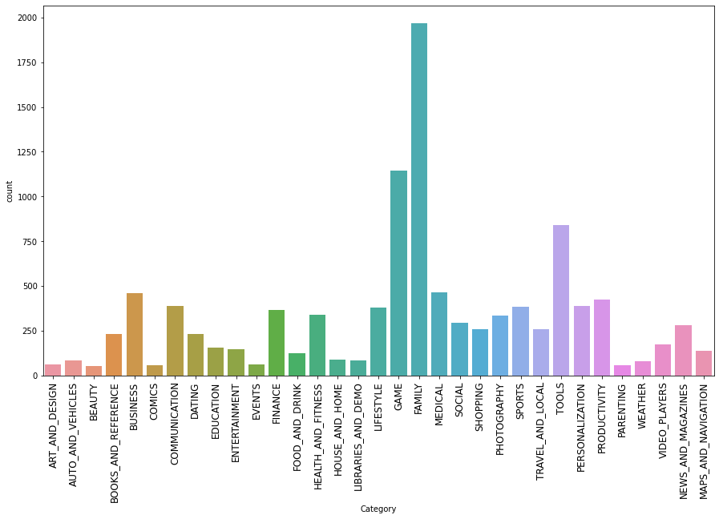
    


---

> ## Apps Count By Type


```python
# Apps Count By Type

df['Type'].value_counts()
```


    Free    10032
    Paid      797
    Name: Type, dtype: int64


```python
# Visualiza Apps Count By Type

plt.figure(figsize=(10,5.5))
sns.countplot(df['Type'],palette='husl')
plt.xticks(rotation='vertical',size=18)
plt.show()
```


    
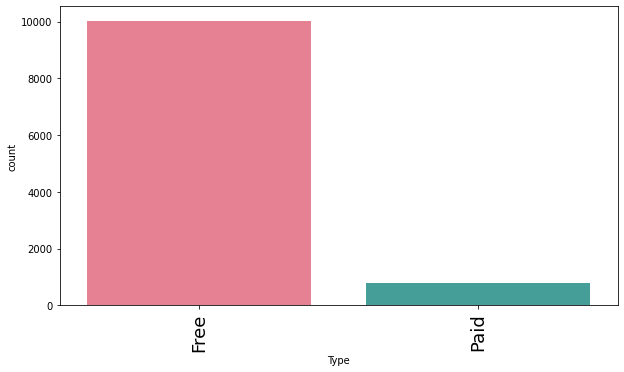
    


---

> ## Apps Count By content Rating


```python
# Apps Count By content rating

df['Content Rating'].value_counts()
```


    Everyone           8704
    Teen               1208
    Mature 17+          499
    Everyone 10+        413
    Adults only 18+       3
    Unrated               2
    Name: Content Rating, dtype: int64


```python
# Visualize Apps Count By Type

plt.figure(figsize=(15,8.5))
sns.countplot(df['Content Rating'],palette='Set2')
plt.xticks(rotation='vertical',size=15)
plt.show()
```


    
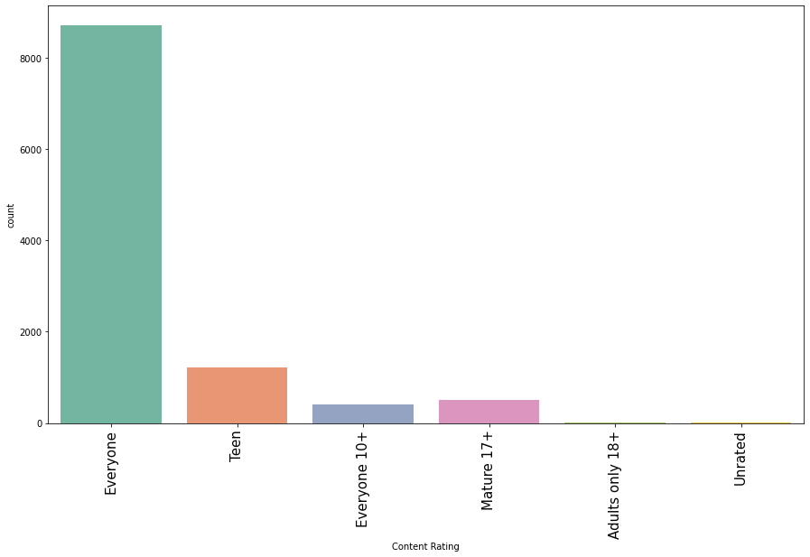
    


--- 

>## Apps Count By Genres


```python
# Apps Count By Type

df['Genres'].value_counts()
```


    Tools                                840
    Entertainment                        622
    Education                            548
    Medical                              463
    Business                             460
                                        ... 
    Parenting;Brain Games                  1
    Travel & Local;Action & Adventure      1
    Board;Pretend Play                     1
    Role Playing;Education                 1
    Trivia;Education                       1
    Name: Genres, Length: 119, dtype: int64


> ## Top 10 Genres With Highest Number Of Apps


```python
df['Genres'].value_counts().head(10)
```


    Tools              840
    Entertainment      622
    Education          548
    Medical            463
    Business           460
    Productivity       424
    Sports             398
    Personalization    390
    Communication      387
    Lifestyle          381
    Name: Genres, dtype: int64


>## Visualiza Top 10 Genres With Highest Number Of Apps


```python
# Visualize Apps Count By Type

plt.figure(figsize=(15,8.5))
df['Genres'].value_counts().head(10).plot(kind='bar')
plt.xticks(rotation='vertical',size=13)
plt.show()
```


    
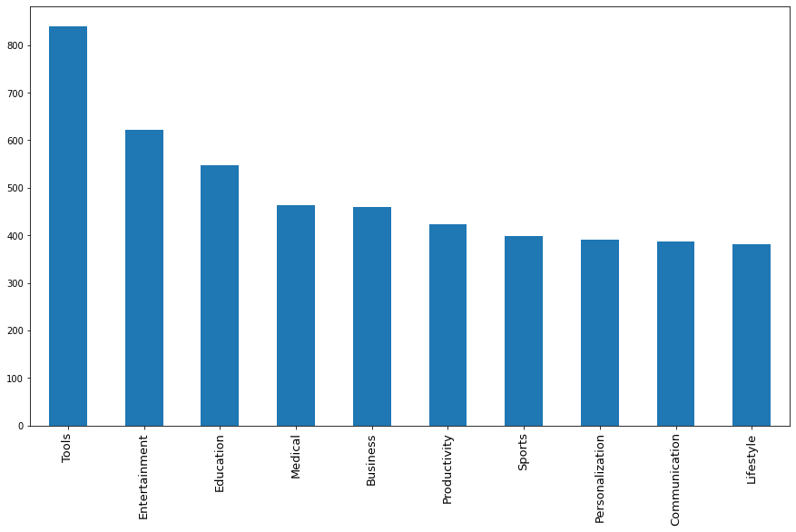
    


---

>## Apps Count By Installtions Amounts 


```python
df['Installs'].value_counts().head(10)
```


    1000000.0     1578
    10000000.0    1252
    100000.0      1169
    10000.0       1052
    1000.0         905
    5000000.0      752
    100.0          718
    500000.0       538
    50000.0        478
    5000.0         476
    Name: Installs, dtype: int64


>## Visualize Apps Count By Installions Amount


```python
# Visualize Apps Count By Type

plt.figure(figsize=(15,8.5))
sns.countplot(df['Installs'],palette='Set2')
plt.xticks(rotation='vertical',size=15)
plt.show()
```


    
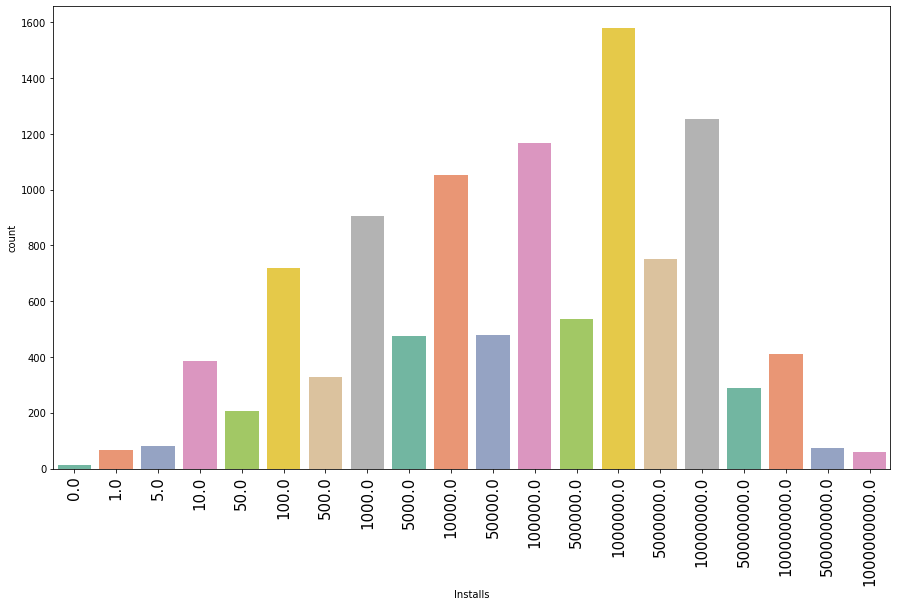
    


---

> ## Apps Count With Last Updated Year


```python
df['Last_Updated_Year'].value_counts()
```


    2018    7344
    2017    1864
    2016     802
    2015     459
    2014     209
    2013     109
    2012      26
    2011      15
    2010       1
    Name: Last_Updated_Year, dtype: int64


>## Visualize Apps Count With Last Updated Year


```python
# Visualize Apps Count With Last Updated Year

plt.figure(figsize=(15,8.5))
sns.countplot(df['Last_Updated_Year'],palette='husl')
plt.xticks(rotation='vertical',size=12)
plt.show()
```


    
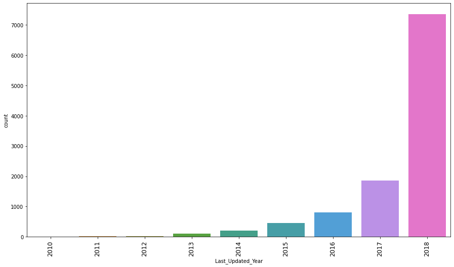
    


---

>## Categories With Highest Number Of Reviews


```python
gr_cat = df.groupby('Category').sum()['Reviews'].reset_index()
```


```python
gr_cat_sort = gr_cat.sort_values('Reviews',ascending=False)
```

>## Top 10 Categories With Highest Number Of Reviews


```python
gr_cat_sort.head(10)
```


<div>
<style scoped>
    .dataframe tbody tr th:only-of-type {
        vertical-align: middle;
    }

    .dataframe tbody tr th {
        vertical-align: top;
    }

    .dataframe thead th {
        text-align: right;
    }
</style>
<table border="1" class="dataframe">
  <thead>
    <tr style="text-align: right;">
      <th></th>
      <th>Category</th>
      <th>Reviews</th>
    </tr>
  </thead>
  <tbody>
    <tr>
      <th>14</th>
      <td>GAME</td>
      <td>1585422349</td>
    </tr>
    <tr>
      <th>6</th>
      <td>COMMUNICATION</td>
      <td>815462260</td>
    </tr>
    <tr>
      <th>27</th>
      <td>SOCIAL</td>
      <td>621241422</td>
    </tr>
    <tr>
      <th>11</th>
      <td>FAMILY</td>
      <td>410226107</td>
    </tr>
    <tr>
      <th>29</th>
      <td>TOOLS</td>
      <td>273181033</td>
    </tr>
    <tr>
      <th>24</th>
      <td>PHOTOGRAPHY</td>
      <td>213516650</td>
    </tr>
    <tr>
      <th>26</th>
      <td>SHOPPING</td>
      <td>115041222</td>
    </tr>
    <tr>
      <th>25</th>
      <td>PRODUCTIVITY</td>
      <td>114116975</td>
    </tr>
    <tr>
      <th>31</th>
      <td>VIDEO_PLAYERS</td>
      <td>110380188</td>
    </tr>
    <tr>
      <th>23</th>
      <td>PERSONALIZATION</td>
      <td>89345721</td>
    </tr>
  </tbody>
</table>
</div>


>## Visualize Top 10 Categories With Highest Number Of Reviews


```python
plt.figure(figsize=(15,8.5))

ax = sns.barplot(x="Reviews", y="Category", data=gr_cat_sort.head(10),
                 palette="Set2")

plt.xticks(rotation='vertical',size=12)
plt.show()

```


    
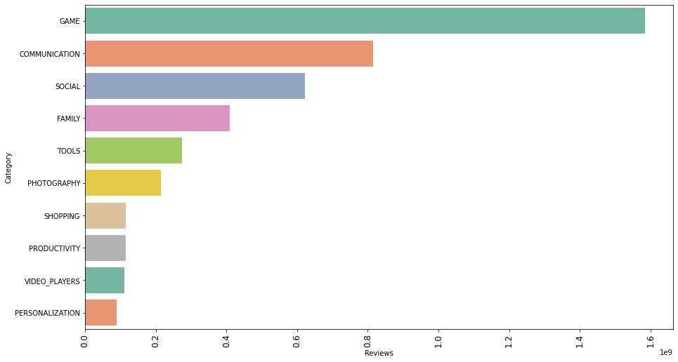
    


---

>## Top 10 Categories With Lowest Number Of Reviews


```python
gr_cat_sort_asc = gr_cat.sort_values('Reviews',ascending=True)
gr_cat_sort_asc.head(10)
```


<div>
<style scoped>
    .dataframe tbody tr th:only-of-type {
        vertical-align: middle;
    }

    .dataframe tbody tr th {
        vertical-align: top;
    }

    .dataframe thead th {
        text-align: right;
    }
</style>
<table border="1" class="dataframe">
  <thead>
    <tr style="text-align: right;">
      <th></th>
      <th>Category</th>
      <th>Reviews</th>
    </tr>
  </thead>
  <tbody>
    <tr>
      <th>10</th>
      <td>EVENTS</td>
      <td>161018</td>
    </tr>
    <tr>
      <th>2</th>
      <td>BEAUTY</td>
      <td>396240</td>
    </tr>
    <tr>
      <th>22</th>
      <td>PARENTING</td>
      <td>958331</td>
    </tr>
    <tr>
      <th>17</th>
      <td>LIBRARIES_AND_DEMO</td>
      <td>1016973</td>
    </tr>
    <tr>
      <th>1</th>
      <td>AUTO_AND_VEHICLES</td>
      <td>1163666</td>
    </tr>
    <tr>
      <th>20</th>
      <td>MEDICAL</td>
      <td>1585975</td>
    </tr>
    <tr>
      <th>0</th>
      <td>ART_AND_DESIGN</td>
      <td>1714385</td>
    </tr>
    <tr>
      <th>5</th>
      <td>COMICS</td>
      <td>3383276</td>
    </tr>
    <tr>
      <th>16</th>
      <td>HOUSE_AND_HOME</td>
      <td>3976385</td>
    </tr>
    <tr>
      <th>7</th>
      <td>DATING</td>
      <td>7291278</td>
    </tr>
  </tbody>
</table>
</div>


>## Visualize Top 10 Categories With Lowest Number Of Reviews


```python
plt.figure(figsize=(15,8.5))

ax = sns.barplot(x="Reviews", y="Category", data=gr_cat_sort_asc.head(10),
                 palette="husl")

plt.xticks(rotation='vertical',size=12)
plt.show()
```


    
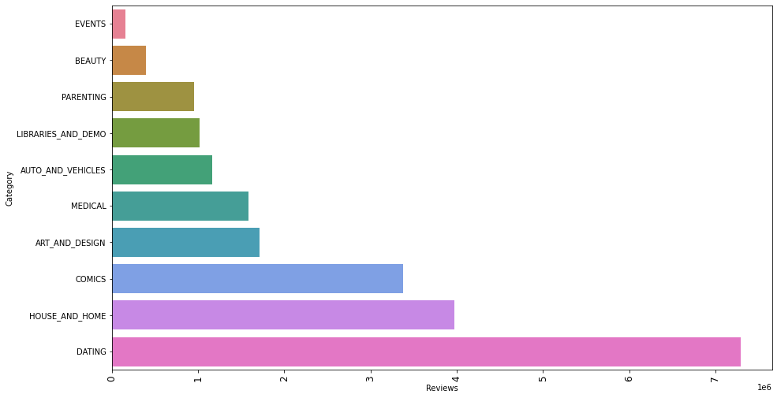
    


---

>## Content Ratings With Reviews Count 


```python
cont_rat = df.groupby('Content Rating').sum()['Reviews'].reset_index()
cont_rat_sort = cont_rat.sort_values('Reviews',ascending=False)
cont_rat_sort
```


<div>
<style scoped>
    .dataframe tbody tr th:only-of-type {
        vertical-align: middle;
    }

    .dataframe tbody tr th {
        vertical-align: top;
    }

    .dataframe thead th {
        text-align: right;
    }
</style>
<table border="1" class="dataframe">
  <thead>
    <tr style="text-align: right;">
      <th></th>
      <th>Content Rating</th>
      <th>Reviews</th>
    </tr>
  </thead>
  <tbody>
    <tr>
      <th>1</th>
      <td>Everyone</td>
      <td>2801822515</td>
    </tr>
    <tr>
      <th>4</th>
      <td>Teen</td>
      <td>1131523721</td>
    </tr>
    <tr>
      <th>2</th>
      <td>Everyone 10+</td>
      <td>683997228</td>
    </tr>
    <tr>
      <th>3</th>
      <td>Mature 17+</td>
      <td>197166533</td>
    </tr>
    <tr>
      <th>0</th>
      <td>Adults only 18+</td>
      <td>81348</td>
    </tr>
    <tr>
      <th>5</th>
      <td>Unrated</td>
      <td>1187</td>
    </tr>
  </tbody>
</table>
</div>


>## Visualize Content Ratings With Reviews Count


```python
plt.figure(figsize=(15,8.5))

ax = sns.barplot(x="Content Rating", y="Reviews", data=cont_rat_sort.head(10),
                 palette="Set2")

plt.xticks(rotation='vertical',size=12)
plt.show()
```


    
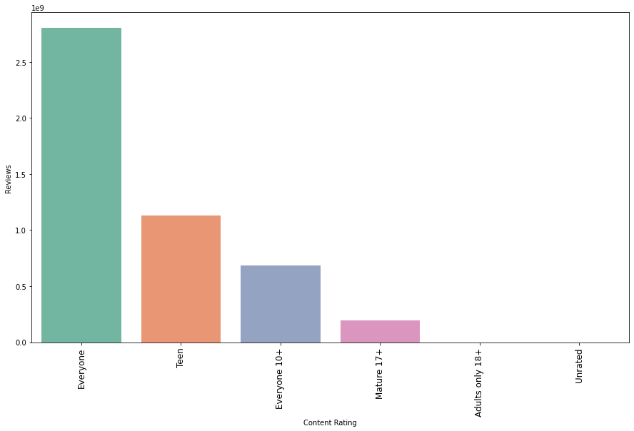
    


---

>## Apps Ratings Distribution 


```python
fig, ax = plt.subplots(1, 1, figsize = (20,10))
df['Rating'].hist(bins=75, ax=ax,histtype='bar',color = "orange")
plt.xlabel('Apps Ratings',fontsize=20)
plt.title('Apps Ratings Distribution ',fontsize=20)
plt.ylabel('Number of Apps',fontsize=20)
```


    Text(0, 0.5, 'Number of Apps')


    
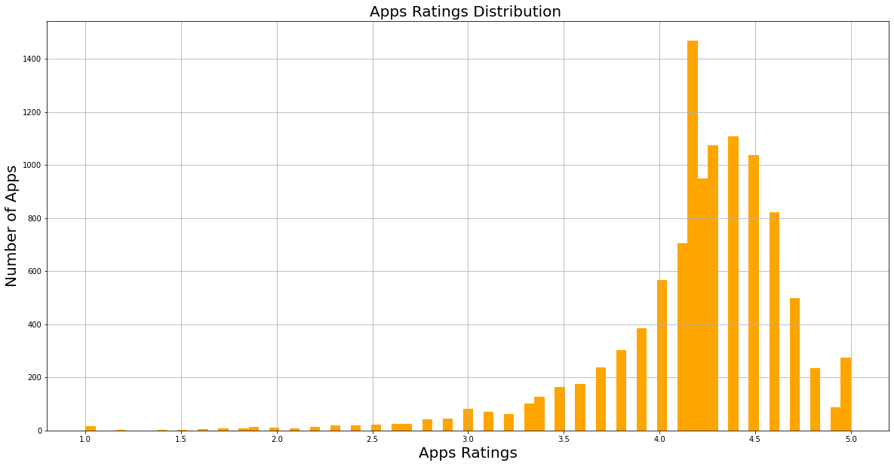
    


---

>## Distriptive Statistic About Apps Ratings


```python
df['Rating'].describe()
```


    count    10829.000000
    mean         4.192041
    std          0.479038
    min          1.000000
    25%          4.100000
    50%          4.200000
    75%          4.500000
    max          5.000000
    Name: Rating, dtype: float64


>## Apps With Highest Ratings ( 5.0 )


```python
high_ratings = pd.DataFrame(df[(df['Rating'] == 5.0)][['App','Category','Rating','Reviews','Installs','Content Rating']])
```


```python
high_ratings.shape
```


    (274, 6)


```python
high_ratings.head(5)
```


<div>
<style scoped>
    .dataframe tbody tr th:only-of-type {
        vertical-align: middle;
    }

    .dataframe tbody tr th {
        vertical-align: top;
    }

    .dataframe thead th {
        text-align: right;
    }
</style>
<table border="1" class="dataframe">
  <thead>
    <tr style="text-align: right;">
      <th></th>
      <th>App</th>
      <th>Category</th>
      <th>Rating</th>
      <th>Reviews</th>
      <th>Installs</th>
      <th>Content Rating</th>
    </tr>
  </thead>
  <tbody>
    <tr>
      <th>329</th>
      <td>Hojiboy Tojiboyev Life Hacks</td>
      <td>COMICS</td>
      <td>5.0</td>
      <td>15</td>
      <td>1000.0</td>
      <td>Everyone</td>
    </tr>
    <tr>
      <th>612</th>
      <td>American Girls Mobile Numbers</td>
      <td>DATING</td>
      <td>5.0</td>
      <td>5</td>
      <td>1000.0</td>
      <td>Mature 17+</td>
    </tr>
    <tr>
      <th>615</th>
      <td>Awake Dating</td>
      <td>DATING</td>
      <td>5.0</td>
      <td>2</td>
      <td>100.0</td>
      <td>Mature 17+</td>
    </tr>
    <tr>
      <th>633</th>
      <td>Spine- The dating app</td>
      <td>DATING</td>
      <td>5.0</td>
      <td>5</td>
      <td>500.0</td>
      <td>Teen</td>
    </tr>
    <tr>
      <th>636</th>
      <td>Girls Live Talk - Free Text and Video Chat</td>
      <td>DATING</td>
      <td>5.0</td>
      <td>6</td>
      <td>100.0</td>
      <td>Mature 17+</td>
    </tr>
  </tbody>
</table>
</div>


>## Highest Rated Apps with There Categories


```python
# Highest rated Apps with there categories

high_ratings['Category'].value_counts()
```


    FAMILY                 67
    LIFESTYLE              29
    MEDICAL                28
    BUSINESS               18
    TOOLS                  17
    HEALTH_AND_FITNESS     12
    GAME                   12
    PERSONALIZATION        10
    PRODUCTIVITY            8
    SOCIAL                  8
    FINANCE                 8
    NEWS_AND_MAGAZINES      7
    EVENTS                  6
    DATING                  6
    SHOPPING                6
    BOOKS_AND_REFERENCE     6
    PHOTOGRAPHY             6
    COMMUNICATION           5
    SPORTS                  4
    TRAVEL_AND_LOCAL        3
    FOOD_AND_DRINK          2
    LIBRARIES_AND_DEMO      2
    COMICS                  2
    PARENTING               1
    ART_AND_DESIGN          1
    Name: Category, dtype: int64


>## Visualize Highest Rated Apps With There Categories


```python
# Visualiza Higiehst rated Apps with there categories

plt.figure(figsize=(15,8.5))
sns.countplot(high_ratings['Category'],palette='husl')
plt.xticks(rotation='vertical',size=13)
plt.show()
```


    
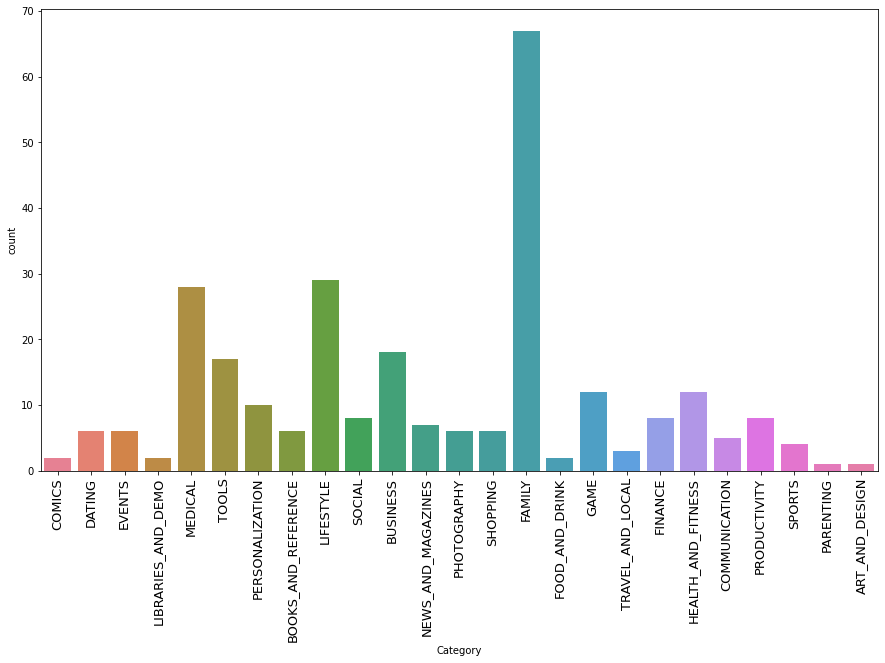
    


---


>## Highest Rated Apps With There Content Ratings


```python
# Highest rated apps with there content ratings

high_ratings['Content Rating'].value_counts()
```


    Everyone        239
    Teen             22
    Mature 17+       11
    Everyone 10+      2
    Name: Content Rating, dtype: int64


>## Visualize Highest Rated Apps With There Content Ratings


```python
plt.figure(figsize=(15,8.5))
sns.countplot(high_ratings['Content Rating'],palette='husl')
plt.xticks(rotation='vertical',size=13)
plt.show()
```


    
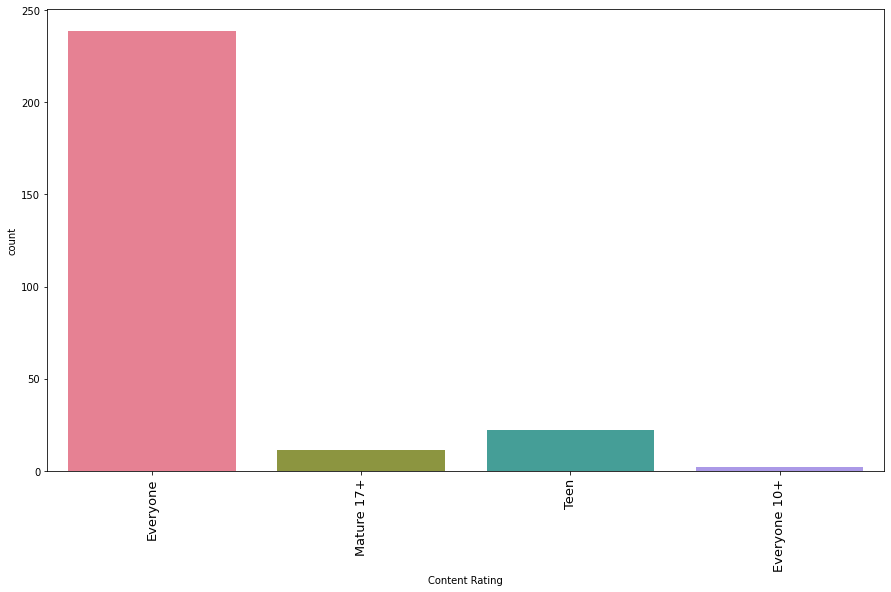
    


---

>## Categories With Installations Count


```python
gr_down = pd.DataFrame(df.groupby('Category').agg({'Installs':sum}).reset_index())
```


```python
gr_down.head
```


    <bound method NDFrame.head of                Category      Installs
    0        ART_AND_DESIGN  1.243331e+08
    1     AUTO_AND_VEHICLES  5.313021e+07
    2                BEAUTY  2.719705e+07
    3   BOOKS_AND_REFERENCE  1.921469e+09
    4              BUSINESS  1.001915e+09
    5                COMICS  5.608615e+07
    6         COMMUNICATION  3.264728e+10
    7                DATING  2.643108e+08
    8             EDUCATION  8.714520e+08
    9         ENTERTAINMENT  2.869160e+09
    10               EVENTS  1.597316e+07
    11               FAMILY  1.025820e+10
    12              FINANCE  8.766487e+08
    13       FOOD_AND_DRINK  2.738988e+08
    14                 GAME  3.508602e+10
    15   HEALTH_AND_FITNESS  1.583073e+09
    16       HOUSE_AND_HOME  1.687125e+08
    17   LIBRARIES_AND_DEMO  6.199591e+07
    18            LIFESTYLE  5.376435e+08
    19  MAPS_AND_NAVIGATION  7.242819e+08
    20              MEDICAL  5.325744e+07
    21   NEWS_AND_MAGAZINES  7.496318e+09
    22            PARENTING  3.152111e+07
    23      PERSONALIZATION  2.325484e+09
    24          PHOTOGRAPHY  1.008825e+10
    25         PRODUCTIVITY  1.417609e+10
    26             SHOPPING  3.247849e+09
    27               SOCIAL  1.406987e+10
    28               SPORTS  1.751174e+09
    29                TOOLS  1.145227e+10
    30     TRAVEL_AND_LOCAL  6.868887e+09
    31        VIDEO_PLAYERS  6.222003e+09
    32              WEATHER  4.261005e+08>


>## Top Categories With Highest Installations Count


```python
gr_down_sort = gr_down.sort_values('Installs',ascending=False)
gr_down_sort
```


<div>
<style scoped>
    .dataframe tbody tr th:only-of-type {
        vertical-align: middle;
    }

    .dataframe tbody tr th {
        vertical-align: top;
    }

    .dataframe thead th {
        text-align: right;
    }
</style>
<table border="1" class="dataframe">
  <thead>
    <tr style="text-align: right;">
      <th></th>
      <th>Category</th>
      <th>Installs</th>
    </tr>
  </thead>
  <tbody>
    <tr>
      <th>14</th>
      <td>GAME</td>
      <td>3.508602e+10</td>
    </tr>
    <tr>
      <th>6</th>
      <td>COMMUNICATION</td>
      <td>3.264728e+10</td>
    </tr>
    <tr>
      <th>25</th>
      <td>PRODUCTIVITY</td>
      <td>1.417609e+10</td>
    </tr>
    <tr>
      <th>27</th>
      <td>SOCIAL</td>
      <td>1.406987e+10</td>
    </tr>
    <tr>
      <th>29</th>
      <td>TOOLS</td>
      <td>1.145227e+10</td>
    </tr>
    <tr>
      <th>11</th>
      <td>FAMILY</td>
      <td>1.025820e+10</td>
    </tr>
    <tr>
      <th>24</th>
      <td>PHOTOGRAPHY</td>
      <td>1.008825e+10</td>
    </tr>
    <tr>
      <th>21</th>
      <td>NEWS_AND_MAGAZINES</td>
      <td>7.496318e+09</td>
    </tr>
    <tr>
      <th>30</th>
      <td>TRAVEL_AND_LOCAL</td>
      <td>6.868887e+09</td>
    </tr>
    <tr>
      <th>31</th>
      <td>VIDEO_PLAYERS</td>
      <td>6.222003e+09</td>
    </tr>
    <tr>
      <th>26</th>
      <td>SHOPPING</td>
      <td>3.247849e+09</td>
    </tr>
    <tr>
      <th>9</th>
      <td>ENTERTAINMENT</td>
      <td>2.869160e+09</td>
    </tr>
    <tr>
      <th>23</th>
      <td>PERSONALIZATION</td>
      <td>2.325484e+09</td>
    </tr>
    <tr>
      <th>3</th>
      <td>BOOKS_AND_REFERENCE</td>
      <td>1.921469e+09</td>
    </tr>
    <tr>
      <th>28</th>
      <td>SPORTS</td>
      <td>1.751174e+09</td>
    </tr>
    <tr>
      <th>15</th>
      <td>HEALTH_AND_FITNESS</td>
      <td>1.583073e+09</td>
    </tr>
    <tr>
      <th>4</th>
      <td>BUSINESS</td>
      <td>1.001915e+09</td>
    </tr>
    <tr>
      <th>12</th>
      <td>FINANCE</td>
      <td>8.766487e+08</td>
    </tr>
    <tr>
      <th>8</th>
      <td>EDUCATION</td>
      <td>8.714520e+08</td>
    </tr>
    <tr>
      <th>19</th>
      <td>MAPS_AND_NAVIGATION</td>
      <td>7.242819e+08</td>
    </tr>
    <tr>
      <th>18</th>
      <td>LIFESTYLE</td>
      <td>5.376435e+08</td>
    </tr>
    <tr>
      <th>32</th>
      <td>WEATHER</td>
      <td>4.261005e+08</td>
    </tr>
    <tr>
      <th>13</th>
      <td>FOOD_AND_DRINK</td>
      <td>2.738988e+08</td>
    </tr>
    <tr>
      <th>7</th>
      <td>DATING</td>
      <td>2.643108e+08</td>
    </tr>
    <tr>
      <th>16</th>
      <td>HOUSE_AND_HOME</td>
      <td>1.687125e+08</td>
    </tr>
    <tr>
      <th>0</th>
      <td>ART_AND_DESIGN</td>
      <td>1.243331e+08</td>
    </tr>
    <tr>
      <th>17</th>
      <td>LIBRARIES_AND_DEMO</td>
      <td>6.199591e+07</td>
    </tr>
    <tr>
      <th>5</th>
      <td>COMICS</td>
      <td>5.608615e+07</td>
    </tr>
    <tr>
      <th>20</th>
      <td>MEDICAL</td>
      <td>5.325744e+07</td>
    </tr>
    <tr>
      <th>1</th>
      <td>AUTO_AND_VEHICLES</td>
      <td>5.313021e+07</td>
    </tr>
    <tr>
      <th>22</th>
      <td>PARENTING</td>
      <td>3.152111e+07</td>
    </tr>
    <tr>
      <th>2</th>
      <td>BEAUTY</td>
      <td>2.719705e+07</td>
    </tr>
    <tr>
      <th>10</th>
      <td>EVENTS</td>
      <td>1.597316e+07</td>
    </tr>
  </tbody>
</table>
</div>


>## Visualize Top Categories With Highest Installations Count


```python
plt.figure(figsize=(10,15))

ax = sns.barplot(x="Installs", y="Category", data=gr_down_sort,
                 palette="Set2")

plt.xticks(rotation='vertical',size=12)
plt.show()
```


    
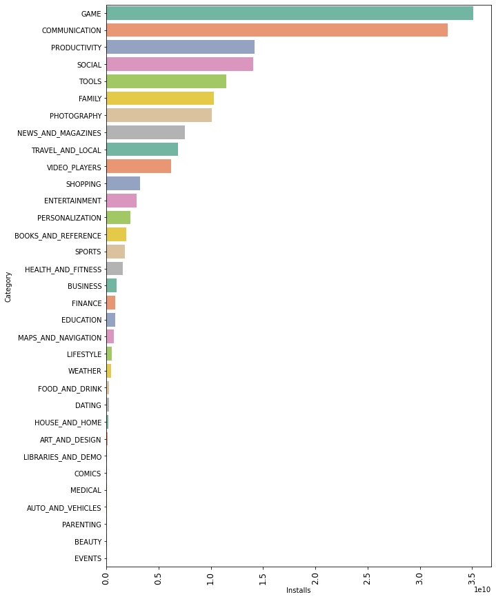
    


---

>## Top Content Rating With Installtion Amount


```python
gr_down_content = pd.DataFrame(df.groupby('Content Rating').agg({'Installs':sum}).reset_index())
gr_down_content_sort = gr_down_content.sort_values('Installs',ascending=False)
gr_down_content_sort
```


<div>
<style scoped>
    .dataframe tbody tr th:only-of-type {
        vertical-align: middle;
    }

    .dataframe tbody tr th {
        vertical-align: top;
    }

    .dataframe thead th {
        text-align: right;
    }
</style>
<table border="1" class="dataframe">
  <thead>
    <tr style="text-align: right;">
      <th></th>
      <th>Content Rating</th>
      <th>Installs</th>
    </tr>
  </thead>
  <tbody>
    <tr>
      <th>1</th>
      <td>Everyone</td>
      <td>1.141551e+11</td>
    </tr>
    <tr>
      <th>4</th>
      <td>Teen</td>
      <td>3.471635e+10</td>
    </tr>
    <tr>
      <th>2</th>
      <td>Everyone 10+</td>
      <td>1.323388e+10</td>
    </tr>
    <tr>
      <th>3</th>
      <td>Mature 17+</td>
      <td>5.524491e+09</td>
    </tr>
    <tr>
      <th>0</th>
      <td>Adults only 18+</td>
      <td>2.000000e+06</td>
    </tr>
    <tr>
      <th>5</th>
      <td>Unrated</td>
      <td>5.050000e+04</td>
    </tr>
  </tbody>
</table>
</div>


>## Visualize Top Content Rating With Installtion Amount


```python
plt.figure(figsize=(10,15))

ax = sns.barplot(x="Content Rating", y="Installs", data=gr_down_content_sort,
                 palette="Set2")

plt.xticks(rotation='vertical',size=12)
plt.show()
```


    
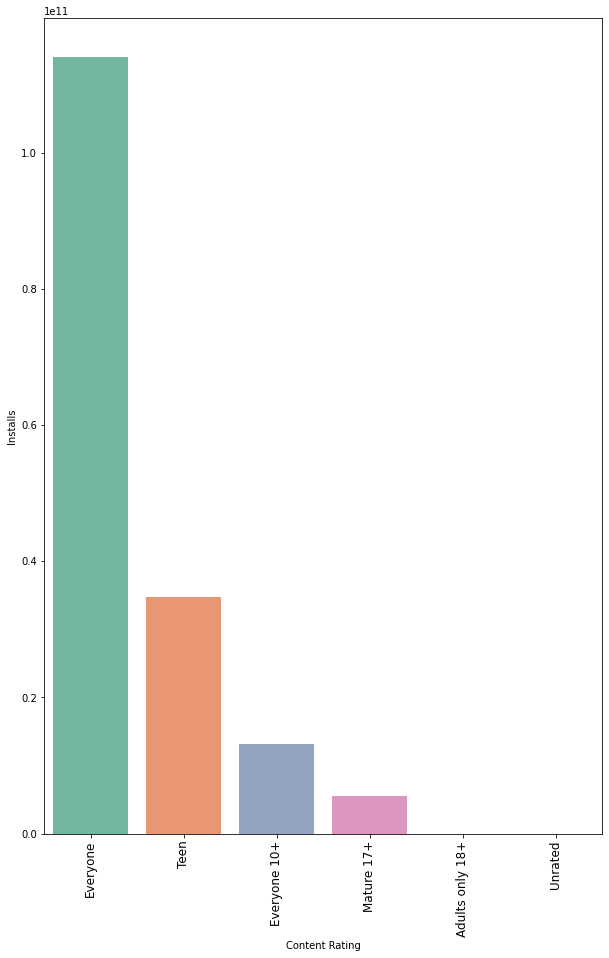
    


---

>## Distribution About Paid Apps 


```python
paid_apps = pd.DataFrame(df[(df['Price'] > 0.0)])
```


```python
paid_apps.shape
```


    (797, 14)


### There are 797 Paid Apps 


```python
paid_apps.head(5)
```


<div>
<style scoped>
    .dataframe tbody tr th:only-of-type {
        vertical-align: middle;
    }

    .dataframe tbody tr th {
        vertical-align: top;
    }

    .dataframe thead th {
        text-align: right;
    }
</style>
<table border="1" class="dataframe">
  <thead>
    <tr style="text-align: right;">
      <th></th>
      <th>App</th>
      <th>Category</th>
      <th>Rating</th>
      <th>Reviews</th>
      <th>Size</th>
      <th>Installs</th>
      <th>Type</th>
      <th>Price</th>
      <th>Content Rating</th>
      <th>Genres</th>
      <th>Last Updated</th>
      <th>Current Ver</th>
      <th>Android Ver</th>
      <th>Last_Updated_Year</th>
    </tr>
  </thead>
  <tbody>
    <tr>
      <th>234</th>
      <td>TurboScan: scan documents and receipts in PDF</td>
      <td>BUSINESS</td>
      <td>4.7</td>
      <td>11442</td>
      <td>6.8M</td>
      <td>100000.0</td>
      <td>Paid</td>
      <td>4.99</td>
      <td>Everyone</td>
      <td>Business</td>
      <td>2018-03-25</td>
      <td>1.5.2</td>
      <td>4.0 and up</td>
      <td>2018</td>
    </tr>
    <tr>
      <th>235</th>
      <td>Tiny Scanner Pro: PDF Doc Scan</td>
      <td>BUSINESS</td>
      <td>4.8</td>
      <td>10295</td>
      <td>39M</td>
      <td>100000.0</td>
      <td>Paid</td>
      <td>4.99</td>
      <td>Everyone</td>
      <td>Business</td>
      <td>2017-04-11</td>
      <td>3.4.6</td>
      <td>3.0 and up</td>
      <td>2017</td>
    </tr>
    <tr>
      <th>290</th>
      <td>TurboScan: scan documents and receipts in PDF</td>
      <td>BUSINESS</td>
      <td>4.7</td>
      <td>11442</td>
      <td>6.8M</td>
      <td>100000.0</td>
      <td>Paid</td>
      <td>4.99</td>
      <td>Everyone</td>
      <td>Business</td>
      <td>2018-03-25</td>
      <td>1.5.2</td>
      <td>4.0 and up</td>
      <td>2018</td>
    </tr>
    <tr>
      <th>291</th>
      <td>Tiny Scanner Pro: PDF Doc Scan</td>
      <td>BUSINESS</td>
      <td>4.8</td>
      <td>10295</td>
      <td>39M</td>
      <td>100000.0</td>
      <td>Paid</td>
      <td>4.99</td>
      <td>Everyone</td>
      <td>Business</td>
      <td>2017-04-11</td>
      <td>3.4.6</td>
      <td>3.0 and up</td>
      <td>2017</td>
    </tr>
    <tr>
      <th>427</th>
      <td>Puffin Browser Pro</td>
      <td>COMMUNICATION</td>
      <td>4.0</td>
      <td>18247</td>
      <td>Varies with device</td>
      <td>100000.0</td>
      <td>Paid</td>
      <td>3.99</td>
      <td>Everyone</td>
      <td>Communication</td>
      <td>2018-07-05</td>
      <td>7.5.3.20547</td>
      <td>4.1 and up</td>
      <td>2018</td>
    </tr>
  </tbody>
</table>
</div>


>## Paid Apps parices Distribution


```python
fig, ax = plt.subplots(1, 1, figsize = (20,10))
paid_apps['Price'].hist(bins=75, ax=ax,histtype='bar')
plt.xlabel('Apps Price',fontsize=20)
plt.title('Apps prices Distribution ',fontsize=20)
plt.ylabel('Number of Apps',fontsize=20)
```


    Text(0, 0.5, 'Number of Apps')


    
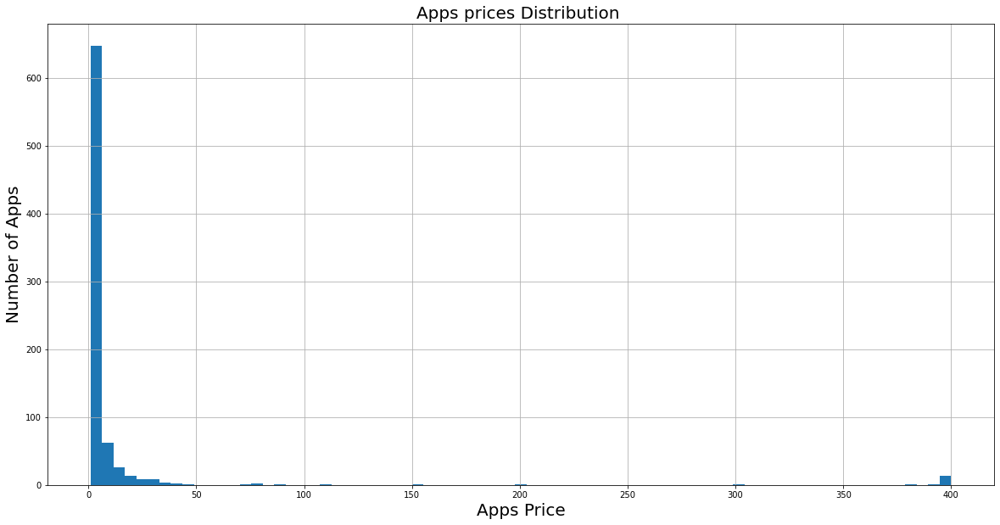
    


>## Paid Apps Ratings Distribution


```python
fig, ax = plt.subplots(1, 1, figsize = (20,10))
paid_apps['Rating'].hist(bins=75, ax=ax,histtype='bar',color = "green")
plt.xlabel('Apps Ratings',fontsize=20)
plt.title('Apps Ratings Distribution ',fontsize=20)
plt.ylabel('Number of Apps',fontsize=20)
```


    Text(0, 0.5, 'Number of Apps')


    
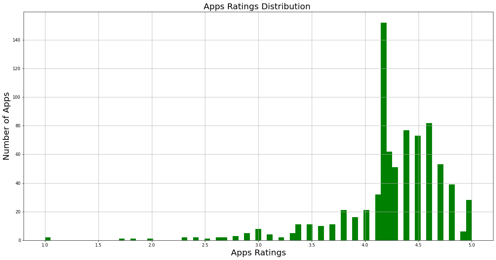
    


>## Paid Apps Category Distribution


```python
plt.figure(figsize=(15,8.5))
sns.countplot(paid_apps['Category'],palette='husl')
plt.xticks(rotation='vertical',size=13)
plt.show()
```


    
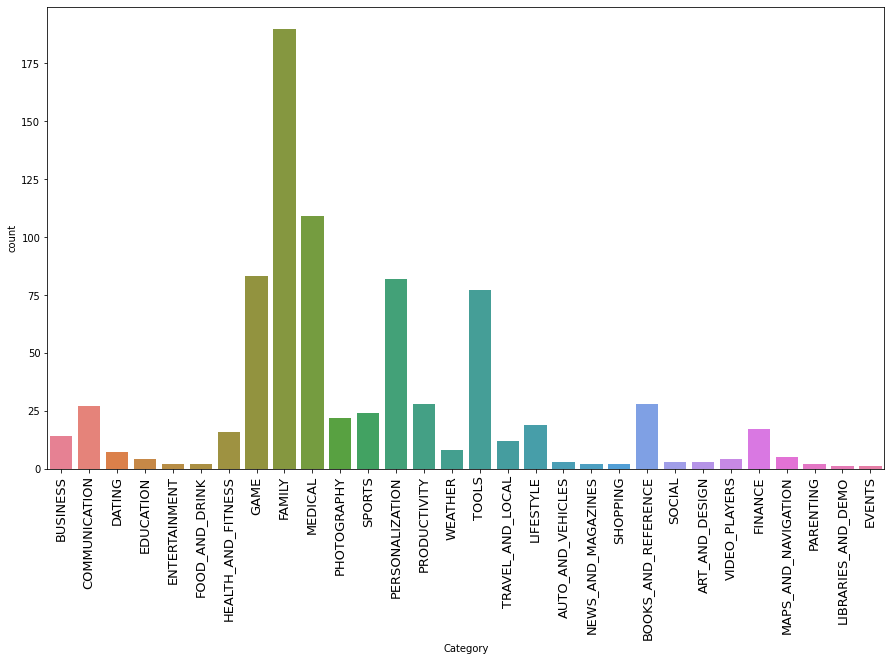
    


>## Paid Apps Genres Distribution


```python
plt.figure(figsize=(18,8.5))
sns.countplot(paid_apps['Genres'],palette='husl')
plt.xticks(rotation='vertical',size=10)
plt.show()
```


    
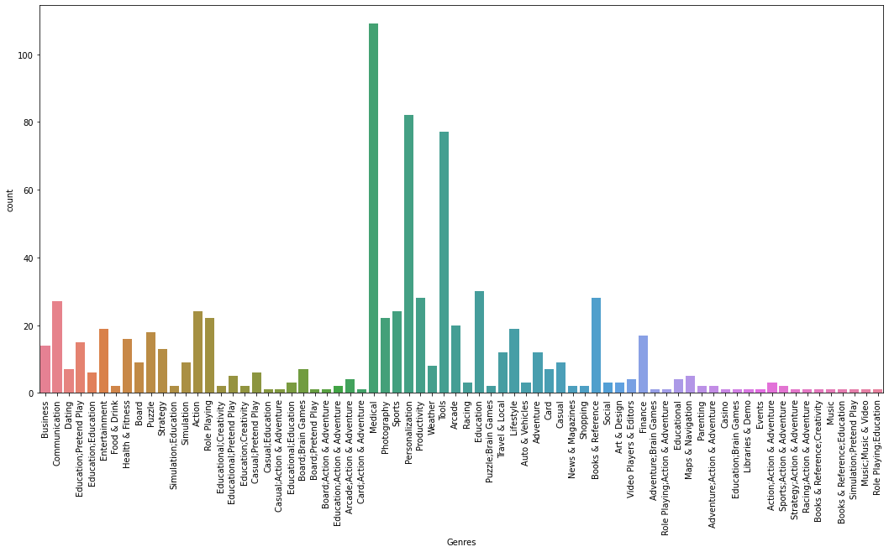
    


>## Alternative Visualization : Paid Apps Genres Distribution


```python
plt.figure(figsize=(15,30))
ax = sns.countplot(y="Genres", data=paid_apps)
plt.show()
```


    
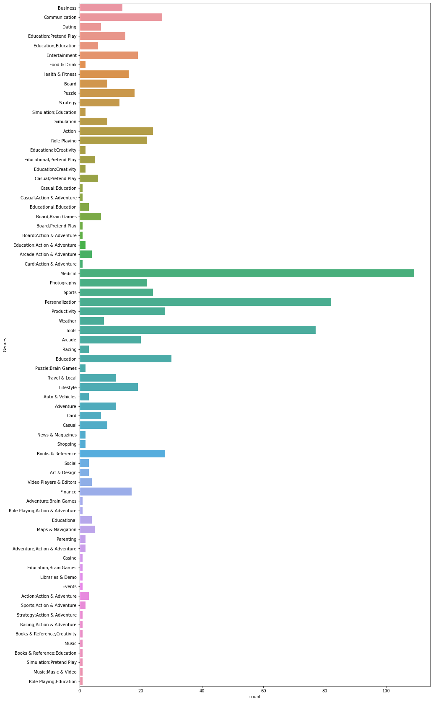
    


>## Most Expensive App 


```python
most_exp_app = pd.DataFrame(df[(df['Price'] == df['Price'].max())])
```


```python
most_exp_app
```


<div>
<style scoped>
    .dataframe tbody tr th:only-of-type {
        vertical-align: middle;
    }

    .dataframe tbody tr th {
        vertical-align: top;
    }

    .dataframe thead th {
        text-align: right;
    }
</style>
<table border="1" class="dataframe">
  <thead>
    <tr style="text-align: right;">
      <th></th>
      <th>App</th>
      <th>Category</th>
      <th>Rating</th>
      <th>Reviews</th>
      <th>Size</th>
      <th>Installs</th>
      <th>Type</th>
      <th>Price</th>
      <th>Content Rating</th>
      <th>Genres</th>
      <th>Last Updated</th>
      <th>Current Ver</th>
      <th>Android Ver</th>
      <th>Last_Updated_Year</th>
    </tr>
  </thead>
  <tbody>
    <tr>
      <th>4367</th>
      <td>I'm Rich - Trump Edition</td>
      <td>LIFESTYLE</td>
      <td>3.6</td>
      <td>275</td>
      <td>7.3M</td>
      <td>10000.0</td>
      <td>Paid</td>
      <td>400.0</td>
      <td>Everyone</td>
      <td>Lifestyle</td>
      <td>2018-05-03</td>
      <td>1.0.1</td>
      <td>4.1 and up</td>
      <td>2018</td>
    </tr>
  </tbody>
</table>
</div>


>## Most Chepest Paid Apps


```python
low_exp_app = pd.DataFrame(df[((df['Price'] > 0.0) & (df['Price'] < 1.0))])
low_exp_app
```


<div>
<style scoped>
    .dataframe tbody tr th:only-of-type {
        vertical-align: middle;
    }

    .dataframe tbody tr th {
        vertical-align: top;
    }

    .dataframe thead th {
        text-align: right;
    }
</style>
<table border="1" class="dataframe">
  <thead>
    <tr style="text-align: right;">
      <th></th>
      <th>App</th>
      <th>Category</th>
      <th>Rating</th>
      <th>Reviews</th>
      <th>Size</th>
      <th>Installs</th>
      <th>Type</th>
      <th>Price</th>
      <th>Content Rating</th>
      <th>Genres</th>
      <th>Last Updated</th>
      <th>Current Ver</th>
      <th>Android Ver</th>
      <th>Last_Updated_Year</th>
    </tr>
  </thead>
  <tbody>
    <tr>
      <th>2171</th>
      <td>All-in-One Mahjong 3</td>
      <td>FAMILY</td>
      <td>4.400000</td>
      <td>38</td>
      <td>16M</td>
      <td>100.0</td>
      <td>Paid</td>
      <td>0.99</td>
      <td>Everyone</td>
      <td>Board;Brain Games</td>
      <td>2018-06-14</td>
      <td>20180609</td>
      <td>4.0 and up</td>
      <td>2018</td>
    </tr>
    <tr>
      <th>2172</th>
      <td>World Racers family board game</td>
      <td>FAMILY</td>
      <td>4.800000</td>
      <td>4</td>
      <td>42M</td>
      <td>100.0</td>
      <td>Paid</td>
      <td>0.99</td>
      <td>Everyone</td>
      <td>Board;Pretend Play</td>
      <td>2015-09-03</td>
      <td>1.1</td>
      <td>5.1 and up</td>
      <td>2015</td>
    </tr>
    <tr>
      <th>2173</th>
      <td>SweetLand — Family Board Game</td>
      <td>FAMILY</td>
      <td>4.200000</td>
      <td>38</td>
      <td>47M</td>
      <td>1000.0</td>
      <td>Paid</td>
      <td>0.99</td>
      <td>Everyone</td>
      <td>Casual;Pretend Play</td>
      <td>2014-11-14</td>
      <td>1.2</td>
      <td>2.3.3 and up</td>
      <td>2014</td>
    </tr>
    <tr>
      <th>2244</th>
      <td>iBP Blood Pressure</td>
      <td>MEDICAL</td>
      <td>4.400000</td>
      <td>578</td>
      <td>704k</td>
      <td>10000.0</td>
      <td>Paid</td>
      <td>0.99</td>
      <td>Everyone</td>
      <td>Medical</td>
      <td>2014-11-30</td>
      <td>7.0.1</td>
      <td>2.2 and up</td>
      <td>2014</td>
    </tr>
    <tr>
      <th>2275</th>
      <td>Blood Pressure Companion</td>
      <td>MEDICAL</td>
      <td>4.200000</td>
      <td>178</td>
      <td>4.8M</td>
      <td>1000.0</td>
      <td>Paid</td>
      <td>0.99</td>
      <td>Everyone</td>
      <td>Medical</td>
      <td>2018-07-22</td>
      <td>4.1.5 (Steglitz)</td>
      <td>4.1 and up</td>
      <td>2018</td>
    </tr>
    <tr>
      <th>...</th>
      <td>...</td>
      <td>...</td>
      <td>...</td>
      <td>...</td>
      <td>...</td>
      <td>...</td>
      <td>...</td>
      <td>...</td>
      <td>...</td>
      <td>...</td>
      <td>...</td>
      <td>...</td>
      <td>...</td>
      <td>...</td>
    </tr>
    <tr>
      <th>10675</th>
      <td>Circle Colors Pack-FN Theme</td>
      <td>PERSONALIZATION</td>
      <td>4.200000</td>
      <td>6</td>
      <td>89k</td>
      <td>50.0</td>
      <td>Paid</td>
      <td>0.99</td>
      <td>Everyone</td>
      <td>Personalization</td>
      <td>2013-08-09</td>
      <td>1</td>
      <td>2.2 and up</td>
      <td>2013</td>
    </tr>
    <tr>
      <th>10682</th>
      <td>Fruit Ninja Classic</td>
      <td>GAME</td>
      <td>4.300000</td>
      <td>85468</td>
      <td>36M</td>
      <td>1000000.0</td>
      <td>Paid</td>
      <td>0.99</td>
      <td>Everyone</td>
      <td>Arcade</td>
      <td>2018-06-08</td>
      <td>2.4.1.485300</td>
      <td>4.0.3 and up</td>
      <td>2018</td>
    </tr>
    <tr>
      <th>10690</th>
      <td>FO Bixby</td>
      <td>PERSONALIZATION</td>
      <td>5.000000</td>
      <td>5</td>
      <td>861k</td>
      <td>100.0</td>
      <td>Paid</td>
      <td>0.99</td>
      <td>Everyone</td>
      <td>Personalization</td>
      <td>2018-04-25</td>
      <td>0.2</td>
      <td>7.0 and up</td>
      <td>2018</td>
    </tr>
    <tr>
      <th>10697</th>
      <td>Mu.F.O.</td>
      <td>GAME</td>
      <td>5.000000</td>
      <td>2</td>
      <td>16M</td>
      <td>1.0</td>
      <td>Paid</td>
      <td>0.99</td>
      <td>Everyone</td>
      <td>Arcade</td>
      <td>2017-03-03</td>
      <td>1</td>
      <td>2.3 and up</td>
      <td>2017</td>
    </tr>
    <tr>
      <th>10735</th>
      <td>FP VoiceBot</td>
      <td>FAMILY</td>
      <td>4.193338</td>
      <td>17</td>
      <td>157k</td>
      <td>100.0</td>
      <td>Paid</td>
      <td>0.99</td>
      <td>Mature 17+</td>
      <td>Entertainment</td>
      <td>2015-11-25</td>
      <td>1.2</td>
      <td>2.1 and up</td>
      <td>2015</td>
    </tr>
  </tbody>
</table>
<p>146 rows × 14 columns</p>
</div>


### There Aree 146 Paid Apps Lower Than 1$

>## Most Cheapest Apps ( Which price Is Lower Than 10$ )


```python
chep_exp_app = pd.DataFrame(df[((df['Price'] > 10.0) & (df['Price'] > 0.0) )])
```


```python
chep_exp_app
```


<div>
<style scoped>
    .dataframe tbody tr th:only-of-type {
        vertical-align: middle;
    }

    .dataframe tbody tr th {
        vertical-align: top;
    }

    .dataframe thead th {
        text-align: right;
    }
</style>
<table border="1" class="dataframe">
  <thead>
    <tr style="text-align: right;">
      <th></th>
      <th>App</th>
      <th>Category</th>
      <th>Rating</th>
      <th>Reviews</th>
      <th>Size</th>
      <th>Installs</th>
      <th>Type</th>
      <th>Price</th>
      <th>Content Rating</th>
      <th>Genres</th>
      <th>Last Updated</th>
      <th>Current Ver</th>
      <th>Android Ver</th>
      <th>Last_Updated_Year</th>
    </tr>
  </thead>
  <tbody>
    <tr>
      <th>2251</th>
      <td>Human Anatomy Atlas 2018: Complete 3D Human Body</td>
      <td>MEDICAL</td>
      <td>4.500000</td>
      <td>2921</td>
      <td>25M</td>
      <td>100000.0</td>
      <td>Paid</td>
      <td>24.99</td>
      <td>Everyone</td>
      <td>Medical</td>
      <td>2018-05-25</td>
      <td>2018.5.47</td>
      <td>5.0 and up</td>
      <td>2018</td>
    </tr>
    <tr>
      <th>2252</th>
      <td>Essential Anatomy 3</td>
      <td>MEDICAL</td>
      <td>4.100000</td>
      <td>1533</td>
      <td>42M</td>
      <td>50000.0</td>
      <td>Paid</td>
      <td>11.99</td>
      <td>Mature 17+</td>
      <td>Medical</td>
      <td>2014-08-07</td>
      <td>1.1.3</td>
      <td>4.0.3 and up</td>
      <td>2014</td>
    </tr>
    <tr>
      <th>2253</th>
      <td>Vargo Anesthesia Mega App</td>
      <td>MEDICAL</td>
      <td>4.600000</td>
      <td>92</td>
      <td>32M</td>
      <td>1000.0</td>
      <td>Paid</td>
      <td>79.99</td>
      <td>Everyone</td>
      <td>Medical</td>
      <td>2018-06-18</td>
      <td>19</td>
      <td>4.0.3 and up</td>
      <td>2018</td>
    </tr>
    <tr>
      <th>2254</th>
      <td>EMT Review Plus</td>
      <td>MEDICAL</td>
      <td>4.500000</td>
      <td>199</td>
      <td>1.8M</td>
      <td>10000.0</td>
      <td>Paid</td>
      <td>11.99</td>
      <td>Everyone</td>
      <td>Medical</td>
      <td>2018-06-27</td>
      <td>3.0.5</td>
      <td>4.4W and up</td>
      <td>2018</td>
    </tr>
    <tr>
      <th>2256</th>
      <td>2017 EMRA Antibiotic Guide</td>
      <td>MEDICAL</td>
      <td>4.400000</td>
      <td>12</td>
      <td>3.8M</td>
      <td>1000.0</td>
      <td>Paid</td>
      <td>16.99</td>
      <td>Everyone</td>
      <td>Medical</td>
      <td>2017-01-27</td>
      <td>1.0.5</td>
      <td>4.0.3 and up</td>
      <td>2017</td>
    </tr>
    <tr>
      <th>...</th>
      <td>...</td>
      <td>...</td>
      <td>...</td>
      <td>...</td>
      <td>...</td>
      <td>...</td>
      <td>...</td>
      <td>...</td>
      <td>...</td>
      <td>...</td>
      <td>...</td>
      <td>...</td>
      <td>...</td>
      <td>...</td>
    </tr>
    <tr>
      <th>9730</th>
      <td>Lean EQ</td>
      <td>BUSINESS</td>
      <td>4.193338</td>
      <td>6</td>
      <td>10M</td>
      <td>10.0</td>
      <td>Paid</td>
      <td>89.99</td>
      <td>Everyone</td>
      <td>Business</td>
      <td>2017-02-14</td>
      <td>1</td>
      <td>4.1 and up</td>
      <td>2017</td>
    </tr>
    <tr>
      <th>9905</th>
      <td>Eu sou Rico</td>
      <td>FINANCE</td>
      <td>4.193338</td>
      <td>0</td>
      <td>2.6M</td>
      <td>0.0</td>
      <td>Paid</td>
      <td>30.99</td>
      <td>Everyone</td>
      <td>Finance</td>
      <td>2018-01-09</td>
      <td>1</td>
      <td>4.0 and up</td>
      <td>2018</td>
    </tr>
    <tr>
      <th>9917</th>
      <td>Eu Sou Rico</td>
      <td>FINANCE</td>
      <td>4.193338</td>
      <td>0</td>
      <td>1.4M</td>
      <td>0.0</td>
      <td>Paid</td>
      <td>394.99</td>
      <td>Everyone</td>
      <td>Finance</td>
      <td>2018-07-11</td>
      <td>1</td>
      <td>4.0.3 and up</td>
      <td>2018</td>
    </tr>
    <tr>
      <th>9934</th>
      <td>I'm Rich/Eu sou Rico/أنا غني/我很有錢</td>
      <td>LIFESTYLE</td>
      <td>4.193338</td>
      <td>0</td>
      <td>40M</td>
      <td>0.0</td>
      <td>Paid</td>
      <td>399.99</td>
      <td>Everyone</td>
      <td>Lifestyle</td>
      <td>2017-12-01</td>
      <td>MONEY</td>
      <td>4.1 and up</td>
      <td>2017</td>
    </tr>
    <tr>
      <th>10782</th>
      <td>Trine 2: Complete Story</td>
      <td>GAME</td>
      <td>3.800000</td>
      <td>252</td>
      <td>11M</td>
      <td>10000.0</td>
      <td>Paid</td>
      <td>16.99</td>
      <td>Teen</td>
      <td>Action</td>
      <td>2015-02-27</td>
      <td>2.22</td>
      <td>5.0 and up</td>
      <td>2015</td>
    </tr>
  </tbody>
</table>
<p>89 rows × 14 columns</p>
</div>


>## Apps With Higher Price ( Higher Than 100$ )


```python
most_exp_app = pd.DataFrame(df[(df['Price'] > 100.0)])
most_exp_app.head()
```


<div>
<style scoped>
    .dataframe tbody tr th:only-of-type {
        vertical-align: middle;
    }

    .dataframe tbody tr th {
        vertical-align: top;
    }

    .dataframe thead th {
        text-align: right;
    }
</style>
<table border="1" class="dataframe">
  <thead>
    <tr style="text-align: right;">
      <th></th>
      <th>App</th>
      <th>Category</th>
      <th>Rating</th>
      <th>Reviews</th>
      <th>Size</th>
      <th>Installs</th>
      <th>Type</th>
      <th>Price</th>
      <th>Content Rating</th>
      <th>Genres</th>
      <th>Last Updated</th>
      <th>Current Ver</th>
      <th>Android Ver</th>
      <th>Last_Updated_Year</th>
    </tr>
  </thead>
  <tbody>
    <tr>
      <th>4197</th>
      <td>most expensive app (H)</td>
      <td>FAMILY</td>
      <td>4.3</td>
      <td>6</td>
      <td>1.5M</td>
      <td>100.0</td>
      <td>Paid</td>
      <td>399.99</td>
      <td>Everyone</td>
      <td>Entertainment</td>
      <td>2018-07-16</td>
      <td>1</td>
      <td>7.0 and up</td>
      <td>2018</td>
    </tr>
    <tr>
      <th>4362</th>
      <td>💎 I'm rich</td>
      <td>LIFESTYLE</td>
      <td>3.8</td>
      <td>718</td>
      <td>26M</td>
      <td>10000.0</td>
      <td>Paid</td>
      <td>399.99</td>
      <td>Everyone</td>
      <td>Lifestyle</td>
      <td>2018-03-11</td>
      <td>1.0.0</td>
      <td>4.4 and up</td>
      <td>2018</td>
    </tr>
    <tr>
      <th>4367</th>
      <td>I'm Rich - Trump Edition</td>
      <td>LIFESTYLE</td>
      <td>3.6</td>
      <td>275</td>
      <td>7.3M</td>
      <td>10000.0</td>
      <td>Paid</td>
      <td>400.00</td>
      <td>Everyone</td>
      <td>Lifestyle</td>
      <td>2018-05-03</td>
      <td>1.0.1</td>
      <td>4.1 and up</td>
      <td>2018</td>
    </tr>
    <tr>
      <th>5351</th>
      <td>I am rich</td>
      <td>LIFESTYLE</td>
      <td>3.8</td>
      <td>3547</td>
      <td>1.8M</td>
      <td>100000.0</td>
      <td>Paid</td>
      <td>399.99</td>
      <td>Everyone</td>
      <td>Lifestyle</td>
      <td>2018-01-12</td>
      <td>2</td>
      <td>4.0.3 and up</td>
      <td>2018</td>
    </tr>
    <tr>
      <th>5354</th>
      <td>I am Rich Plus</td>
      <td>FAMILY</td>
      <td>4.0</td>
      <td>856</td>
      <td>8.7M</td>
      <td>10000.0</td>
      <td>Paid</td>
      <td>399.99</td>
      <td>Everyone</td>
      <td>Entertainment</td>
      <td>2018-05-19</td>
      <td>3</td>
      <td>4.4 and up</td>
      <td>2018</td>
    </tr>
  </tbody>
</table>
</div>


```python
most_exp_app.shape
```


    (20, 14)


###  There Are Paid 20 Apps With Higher Than 100$ Price

>## Visualize Apps With Higher Price ( Higher Than 100$ ) Vs There Genres


```python
plt.figure(figsize=(18,8.5))
sns.countplot(most_exp_app['Genres'],palette='husl')
plt.xticks(rotation='vertical',size=10)
plt.show()
```


    
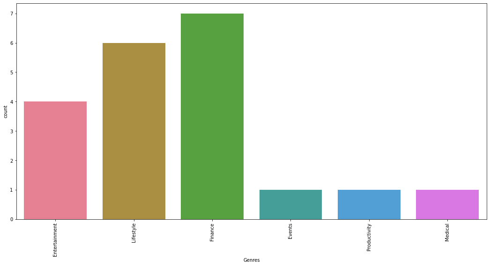
    


>## Paid Apps With Moderate Price ( Lower Than 100$ )


```python
moderate_exp_app = pd.DataFrame(df[((df['Price'] < 100.0) & (df['Price'] > 0.0 ))])
moderate_exp_app.head()
```


<div>
<style scoped>
    .dataframe tbody tr th:only-of-type {
        vertical-align: middle;
    }

    .dataframe tbody tr th {
        vertical-align: top;
    }

    .dataframe thead th {
        text-align: right;
    }
</style>
<table border="1" class="dataframe">
  <thead>
    <tr style="text-align: right;">
      <th></th>
      <th>App</th>
      <th>Category</th>
      <th>Rating</th>
      <th>Reviews</th>
      <th>Size</th>
      <th>Installs</th>
      <th>Type</th>
      <th>Price</th>
      <th>Content Rating</th>
      <th>Genres</th>
      <th>Last Updated</th>
      <th>Current Ver</th>
      <th>Android Ver</th>
      <th>Last_Updated_Year</th>
    </tr>
  </thead>
  <tbody>
    <tr>
      <th>234</th>
      <td>TurboScan: scan documents and receipts in PDF</td>
      <td>BUSINESS</td>
      <td>4.7</td>
      <td>11442</td>
      <td>6.8M</td>
      <td>100000.0</td>
      <td>Paid</td>
      <td>4.99</td>
      <td>Everyone</td>
      <td>Business</td>
      <td>2018-03-25</td>
      <td>1.5.2</td>
      <td>4.0 and up</td>
      <td>2018</td>
    </tr>
    <tr>
      <th>235</th>
      <td>Tiny Scanner Pro: PDF Doc Scan</td>
      <td>BUSINESS</td>
      <td>4.8</td>
      <td>10295</td>
      <td>39M</td>
      <td>100000.0</td>
      <td>Paid</td>
      <td>4.99</td>
      <td>Everyone</td>
      <td>Business</td>
      <td>2017-04-11</td>
      <td>3.4.6</td>
      <td>3.0 and up</td>
      <td>2017</td>
    </tr>
    <tr>
      <th>290</th>
      <td>TurboScan: scan documents and receipts in PDF</td>
      <td>BUSINESS</td>
      <td>4.7</td>
      <td>11442</td>
      <td>6.8M</td>
      <td>100000.0</td>
      <td>Paid</td>
      <td>4.99</td>
      <td>Everyone</td>
      <td>Business</td>
      <td>2018-03-25</td>
      <td>1.5.2</td>
      <td>4.0 and up</td>
      <td>2018</td>
    </tr>
    <tr>
      <th>291</th>
      <td>Tiny Scanner Pro: PDF Doc Scan</td>
      <td>BUSINESS</td>
      <td>4.8</td>
      <td>10295</td>
      <td>39M</td>
      <td>100000.0</td>
      <td>Paid</td>
      <td>4.99</td>
      <td>Everyone</td>
      <td>Business</td>
      <td>2017-04-11</td>
      <td>3.4.6</td>
      <td>3.0 and up</td>
      <td>2017</td>
    </tr>
    <tr>
      <th>427</th>
      <td>Puffin Browser Pro</td>
      <td>COMMUNICATION</td>
      <td>4.0</td>
      <td>18247</td>
      <td>Varies with device</td>
      <td>100000.0</td>
      <td>Paid</td>
      <td>3.99</td>
      <td>Everyone</td>
      <td>Communication</td>
      <td>2018-07-05</td>
      <td>7.5.3.20547</td>
      <td>4.1 and up</td>
      <td>2018</td>
    </tr>
  </tbody>
</table>
</div>


```python
moderate_exp_app.shape
```


    (777, 14)


### There Are 777 Paid Apps With Moderate Price ( Lower Than 100$ )

>## Moderate Price Apps vs there Genres


```python
# Apps Count By Type

moderate_exp_app['Genres'].value_counts().head(20)

```


    Medical                   108
    Personalization            82
    Tools                      77
    Education                  30
    Books & Reference          28
    Communication              27
    Productivity               27
    Sports                     24
    Action                     24
    Photography                22
    Role Playing               22
    Arcade                     20
    Puzzle                     18
    Health & Fitness           16
    Entertainment              15
    Education;Pretend Play     15
    Business                   14
    Strategy                   13
    Lifestyle                  13
    Adventure                  12
    Name: Genres, dtype: int64


>## Visualize Moderate Price Apps vs there Genres


```python
plt.figure(figsize=(10,50))
sns.countplot(y=moderate_exp_app['Genres'], palette ='husl')
plt.xticks(rotation='vertical',size=10)
plt.show()
```


    
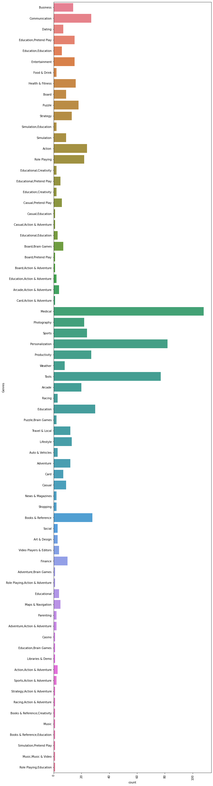
    


---

## Visualization How Apps Ratings & Reviews Distributed


```python
pl=sns.relplot(x='Rating',y='Reviews',data=df)
pl.fig.set_size_inches(15,8)
plt.show()
```


    
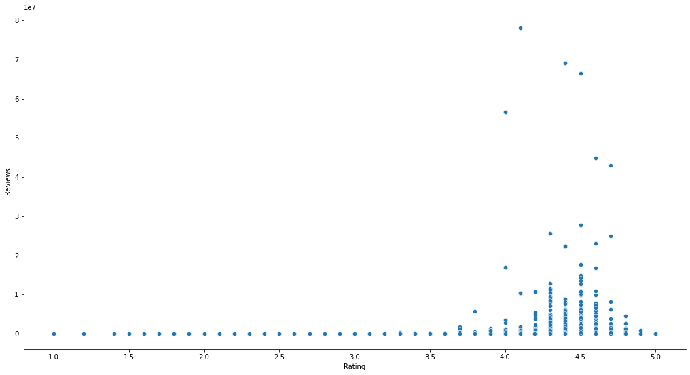
    


```python

```
